::: {.callout-tip icon=false}

## Github Repo Link

[Final Project's Github Repo](https://github.com/bunmam-ctrl/stat301-spring-final.git)

:::

## Introduction

In the United States, nearly one in ten hospitalized patients who require intensive care will not survive their hospital stay, according to data from the Society of Critical Care Medicine [@Hook]. Despite continuous monitoring and advanced treatment options, subtle signs of patient decline often go undetected until it is too late. Early identification of patients at high risk of death remains a critical, unmet need in modern healthcare.

This project aims to develop a **classification-based supervised learning model** to predict in-hospital mortality—whether a patient will **survive or die**—based on data available during admission. By analyzing vital signs, laboratory measurements, comorbidities, and other clinical indicators, the model seeks to uncover patterns associated with mortality risk. A robust predictive system can support clinicians in prioritizing care, improving intervention timing, and ultimately saving lives by preventing avoidable deaths.

## Data Overview

The [Patient Survival Dataset](https://www.kaggle.com/datasets/mitishaagarwal/patient/dat) from Kaggle provides the foundation for developing a predictive model aimed at estimating in-hospital mortality for admitted patients. This dataset offers a rich set of clinical features, vital signs, laboratory results, and patient demographics, enabling comprehensive analysis of survival outcomes in a hospital setting.

Given that the target variable for this project was **in-hopsital mortality**, it was important to examine its distribution to make decisions about data splitting. As can be seen in @fig-plot-death-plot, there is a severe class imbalance. There are over 80,000 observations for those who survived, while there are only about 8,000 observations for those who died. Severe class imbalance can inhibit predictive model performance, as the model will be trained disproportionately on data corresponding to those who survived. In order to counteract this effect, we chose to use downsampling techniques, which will be described in further detail in the methods section.

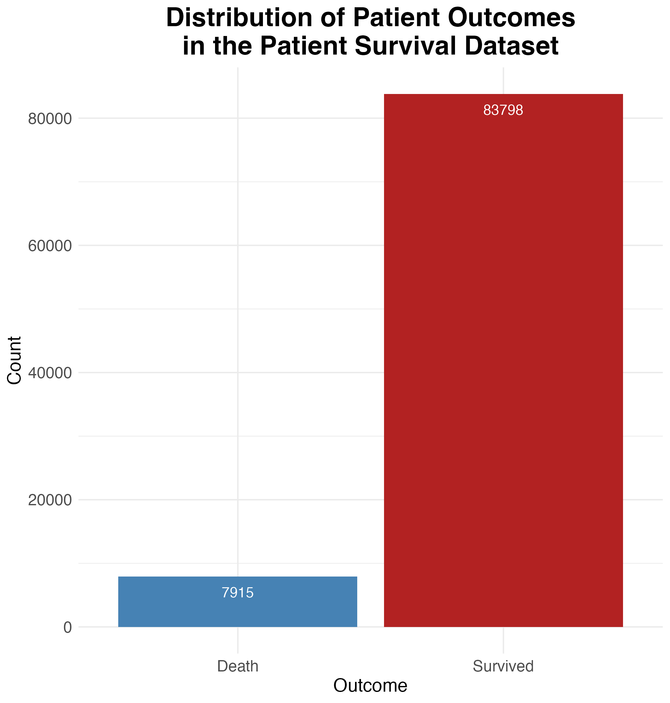{#fig-plot-death-plot}

When thinking about building a predictive model, it is also important to look at any missingness as any columns with too much missingness inhibit the ability to train a model. As shown in @fig-plot-missingness, there is one variable that exhibits **complete missingness** (`...84`), meaning it contains no observed values across any records in the dataset. Since this variable provides no usable information, it can be safely **removed** without affecting the predictive quality of the model. However, for many other predictor variables, there is some level of missingness, albeit not substantial. Since none of these predictors have missingess over 20 percent, standard imputation steps can be implemented to deal with missingness in the recipe-building stage.

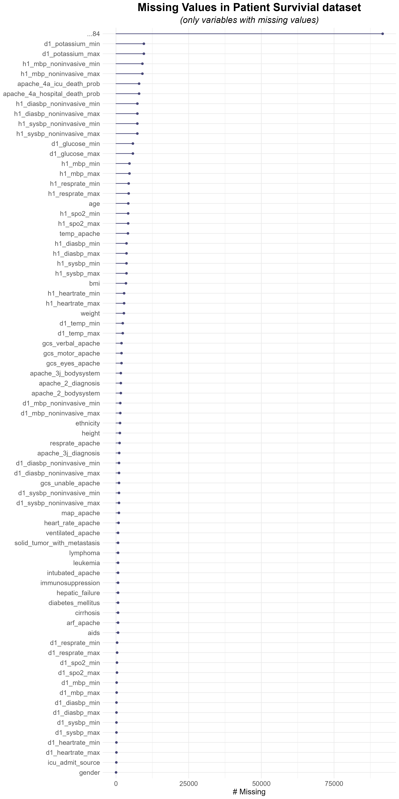{#fig-plot-missingness}

## Data Splitting

The patient survival dataset comprises 91,713 observations and 85 variables. Due to a substantial class imbalance in the outcome variable `hospital_death` (approximately 10.6:1), a downsampling approach was employed to adjust the majority class (survivors) to a 2:1 ratio relative to the minority class (deaths). To support reliable model development, the data was partitioned using an **80/20 stratified split**, ensuring proportional representation of the outcome classes in both training and testing subsets.

To facilitate robust model evaluation and prevent overfitting, **5-fold cross-validation with 3 repeats** was applied to the training data, stratified by the outcome variable. This resampling strategy supports consistent performance estimation across all stages of the modeling pipeline, including **model building**, **hyperparameter tuning**, and **final model refinement**. The training data, testing data, cross-validation folds, and control parameters for resampling were saved and reused to ensure reproducibility and consistency across the analytical workflow.

## Model Building 

### 1. Model Description

A total of **12 models** were developed and evaluated in this project. These included a **null model**, a **baseline model**, an **ensemble model**, and nine additional classification models: **logistic regression**, **boosted tree**, **elastic net**, **k-nearest neighbors (KNN)**, **multivariate adaptive regression splines (MARS)**, **neural network**, **random forest**, and two **support vector machine (SVM)** models (radial and polynomial kernels).

The **null model** and **baseline model** served as benchmarks. The null model was implemented using the default specification provided by the **`tidymodels`** framework, which predicts the majority class regardless of input features. The baseline model was defined as a **naive Bayes classifier**, accompanied by a simple preprocessing recipe (discussed in detail in the preprocessing section), providing a more informed benchmark than the null model.

The remaining models encompassed a diverse range of statistical and machine learning algorithms. The **logistic regression** model served as a baseline interpretable classifier. The **boosted tree** model, an ensemble of sequential decision trees, and the **random forest** model, which aggregates multiple parallel decision trees, were both included. The **KNN** model used similarity-based classification. The **elastic net** model combined lasso and ridge penalties to optimize regularization. The **MARS** model allowed for adaptive spline fitting. The **neural network** model enabled learning of complex nonlinear relationships. Two **SVM models** with **radial** and **polynomial kernels** were also assessed to capture nonlinear decision boundaries.

In addition to these individual models, an **ensemble model** was developed by combining the **elastic net** and **MARS** models. This approach was designed to leverage the strengths of both linear regularization and flexible spline-based modeling, with the goal of improving predictive robustness and performance.

For the seven non-benchmark models, **hyperparameter tuning** was conducted using cross-validation to identify optimal submodels. The table below summarizes the specific hyperparameters tuned for each model type:

| **Model**               | **Hyperparameters Tuned**                                                                |
| ----------------------- | ---------------------------------------------------------------------------------------- |
| Elastic Net             | Penalty, mixture (balance between lasso and ridge)                                       |
| K-Nearest Neighbors     | Number of neighbors                                                                      |
| Random Forest           | Minimum node size, number of predictors sampled at each split                            |
| Boosted Tree            | Minimum node size, number of predictors sampled at each split, shrinkage (learning rate) |
| MARS                    | Number of retained terms, maximum interaction degree                                     |
| Neural Network          | Number of hidden units, regularization penalty, number of training epochs                |
| SVM (Radial Kernel)     | Cost, RBF kernel sigma                                                                   |
| SVM (Polynomial Kernel) | Cost, degree, scale factor                                                               |

: Overview of machine learning models and tuned parameters for `hospital_death` prediction {#tbl-model-use .striped .hover}

Model performance was assessed using the **Receiver Operating Characteristic Area Under the Curve (ROC-AUC)** metric. This measure captures the model's ability to discriminate between the two outcome classes—hospital survival and hospital death—across all possible classification thresholds, making it particularly suitable for imbalanced classification tasks.


### 2. Preprocessing Strategies

To support the diverse modeling approaches in this project, five tailored preprocessing recipes were developed. Each was aligned with the specific requirements and assumptions of the corresponding model types. Across all recipes, non-informative variables—including `encounter_id`, `patient_id`, `hospital_id`, and variable `...84` (which exhibited complete missingness)—were removed, as these offered no predictive value and posed a risk of introducing noise or data leakage.

#### a) Naive Bayes Recipe

This minimal recipe was developed for the **naive Bayes model**, which was used as a **baseline model** for comparison against more complex classifiers. Given the model's assumption of feature independence and sensitivity to feature distributions, preprocessing was deliberately limited. The steps included:

- Removal of identification variables and fully missing columns.
- Median imputation for numeric variables and mode imputation for categorical variables.
- Filtering of **near-zero variance** numeric features.
- Removal of **highly correlated numeric predictors**, using a 0.9 correlation threshold, to preserve the model’s assumptions of conditional independence.

#### b) General Recipe

This primary preprocessing pipeline was used for models that require scaled and encoded input features. Specifically, it was applied to the **null**, **logistic regression**, **elastic net**, **k-nearest neighbors**, **neural network**, and **support vector machine** models. The recipe included:

- Removal of identification variables and variables with complete missingness.
- Imputation of missing values using the **median** for numeric predictors and the **mode** for categorical predictors.
- Grouping of infrequent categorical levels using a **threshold of 5%**, consolidating rare levels into an `"other"` category.
- Introduction of a novel level placeholder to handle unseen categories during prediction.
- **Dummy encoding** (binary indicator variables) for categorical predictors using a k-1 scheme.
- Removal of **near-zero variance** numeric variables.
- **Normalization** of numeric predictors through centering and scaling to ensure feature comparability.

#### c) Tree-based Recipe

This recipe was applied to both the **random forest** and **boosted tree** models. It closely followed the structure of the general recipe, with the key distinction being the use of **one-hot encoding** rather than standard dummy encoding. One-hot encoding retains all levels of a categorical variable as individual binary columns, which is preferred for tree-based models since they are not sensitive to collinearity.

For the **boosted tree model**, an additional step was included to improve model interpretability and reduce redundancy: the removal of **highly correlated numeric predictors** using `step_corr()` with a threshold of 0.9. This step was added based on initial model diagnostics that suggested performance improvements when addressing multicollinearity.

All other preprocessing steps—including the removal of identification variables, median and mode imputation, grouping of rare categorical levels, and normalization of numeric predictors—remained consistent across both models.

#### d) MARS Recipe

Designed specifically for the **MARS (Multivariate Adaptive Regression Splines)** model, this recipe emphasized flexibility in modeling nonlinear relationships and detecting interactions. It included:

- Median and mode imputation for numeric and categorical predictors, respectively.
- Application of the **Yeo-Johnson transformation** to normalize skewed numeric predictors.
- **One-hot encoding** of categorical variables to preserve all levels for interaction modeling.
- Grouping of infrequent levels and inclusion of unseen level indicators.
- Removal of **highly correlated numeric predictors**, using a **correlation threshold of 0.9**, to reduce multicollinearity and improve interpretability.

### 3. Hyperparameter Tuning

To optimize model performance, hyperparameter tuning was performed using grid search techniques across a range of predefined parameter values. Most models used a **regular grid search**, while the **neural network** model used a **space-filling grid** to better capture non-linear parameter interactions. Each model was tuned using 5-fold cross-validation with 3 repeats on the training set.^[[Data Overview](file:///Users/bongbanana/Desktop/Stat%20301-3/final-project-3-women-in-stem/women_in_stem_final_report.html#data-overview)] The control settings ensured predictions and workflows were saved for downstream ensemble modeling and refinement.

| **Model**           | **Tuned Hyperparameters**                                   | **Grid Type** | **Grid Size** |
| ------------------- | ----------------------------------------------------------- | ------------- | ------------- |
| Elastic Net         | `mixture` (0–1), `penalty` (10⁻³–10⁰)                       | Regular       | 10 × 10       |
| K-Nearest Neighbors | `neighbors` (150–230)                                       | Regular       | 7             |
| Random Forest       | `mtry` (1–10), `min_n`                                      | Regular       | 3 × 3         |
| Boosted Tree        | `mtry` (1–10), `trees`, `min_n`, `learn_rate` (10⁻³–10⁻⁰.³) | Regular       | 3 × 3 × 3 × 3 |
| SVM (Radial)        | `cost`, `rbf_sigma`                                         | Regular       | 3 × 3         |
| SVM (Polynomial)    | `cost`, `degree`, `scale_factor`                            | Regular       | 3 × 3 × 3     |
| Neural Network      | `hidden_units`, `penalty`                                   | Space-filling | 20            |
| MARS                | `num_terms`, `prod_degree`                                  | Regular       | 3 × 3         |

: Hyperparameter tuning grids by models {#tbl-model-use .striped .hover}


| **Model Type**      | **Number of Models** | **Total Number of Trainings¹** |
| :------------------ | -------------------: | -----------------------------: |
| Null                |                    1 |                             50 |
| Logistic Regression |                    1 |                             50 |
| Elastic Net         |                  100 |                          5,000 |
| K-Nearest Neighbors |                    7 |                            350 |
| Random Forest       |                    9 |                            450 |
| Boosted Tree        |                   81 |                          4,050 |
| SVM (Radial)        |                    9 |                            450 |
| SVM (Polynomial)    |                   27 |                          1,350 |
| Neural Network      |                   20 |                          1,000 |
| MARS                |                    9 |                            450 |
| **Total**           |                  264 |                         13,200 |

: Summary of model configurations and total training runs.^[Total trainings = Number of models × 50 resampling iterations (5 folds × 3 repeats + 1 final fit + extras)] {#tbl-mod-totals-class .striped .hover}


### 4. Model Selection ^[For details on ensemble model performance, see [Appendix Section 3](file:///Users/bongbanana/Desktop/Stat%20301-3/final-project-3-women-in-stem/women_in_stem_final_report.html#ensemble-model)]

It should be reiterated that the primary metric used to evaluate and compare all classification models was the **area under the receiver operating characteristic curve (ROC-AUC)**.^[[Section 1 of Model Building](file:///Users/bongbanana/Desktop/Stat%20301-3/final-project-3-women-in-stem/women_in_stem_final_report.html#model-description)] This metric was selected for its robustness in assessing binary classification performance, particularly in the presence of class imbalance.

As summarized in @tbl-roc-auc-1, nearly all tuned models—excluding the null model—achieved relatively strong and comparable ROC-AUC scores. Nonetheless, certain model types demonstrated slightly superior performance. The **boosted tree model** achieved the highest mean ROC-AUC (0.89472), followed by the **random forest model** (0.88594), and the **polynomial support vector machine model (SVM)** (0.87699). These results suggest that tree-based methods generally outperformed other model families in this dataset.

In comparison, simpler models performed modestly. The **naive Bayes model**, which served as the **baseline**, yielded a ROC-AUC of 0.85638 with a standard error of 0.00197. While this result demonstrates decent discriminative ability, it was **clearly outperformed by the more advanced models**, particularly the tree-based models and polynomial SVM, which offered **statistically and practically significant improvements** in performance. The **null model**, which always predicts the majority class, yielded a ROC-AUC of 0.50000, confirming its role as a non-informative reference point.

Other models such as **logistic regression** (ROC-AUC = 0.86924), **elastic net**(0.86964), **MARS** (0.85708), **K-nearest neighbors** (0.85550), and **radial SVM** (0.86408) also performed well, but none exceeded the performance of the top three models. Notably, the **radial SVM model**, despite a respectable ROC-AUC, required over 2,500 minutes of runtime, making it computationally inefficient for further consideration.

```{r}
#| label: tbl-roc-auc-1
#| echo: false
#| tbl-cap: "ROC-AUC Performance of Tuned Classification Models"

load(here::here("1_model_building/results/tune_roc_tbl.rda"))
knitr::kable(tune_roc_tbl, digits = 5)
```


Based on these results, three models were selected for further refinement: the **boosted tree, random forest**, and **neural network models**. The first two were chosen due to their top-ranked performance, while the neural network was selected as the next best-performing model with a **significantly lower runtime** than the polynomial support vector machine, despite similar performance. The polynomial SVM model was excluded from refinement due to its extensive runtime (over 4 hours), which rendered it impractical relative to its marginal performance gain.

Before proceeding to model refinement, it is important to review the **optimal hyperparameters** identified for each of the three selected models. These are summarized in @tbl-rf-param, @tbl-bt-param, and @tbl-nn-param.


As reported in @tbl-rf-param, the best-performing **random forest model** was tuned with 1,000 trees, a maximum `mtry` value of 10 (which was the upper limit of the tuning grid), and a `min_n` value of 2. The fact that `mtry` reached the top of the search space suggests that future refinement should consider expanding this range to higher values such as 20 or 30.

@tbl-bt-param shows the optimal configuration for the **boosted tree model**, which also used 1,000 trees, `mtry = 10`, and `min_n = 2`, with a `learn_rate` of approximately 0.0224. Similar to the random forest, the `mtry` value hitting the tuning grid ceiling indicates that further exploration of larger values is warranted.


Finally, @tbl-nn-param presents the best tuning combination for the **neural network**, which achieved its top performance with a `hidden_units` of 7 and a `penalty` of 1. The initial tuning grid spanned 2 to 10 hidden units, so the selection of 7 suggests that refinement should narrow the grid to a more focused range, such as 5 to 8, to fine-tune the network architecture.


## Model Tuning

### 1. Model Description

Three models were selected for further refinement based on their superior performance during the initial evaluation phase: the **boosted tree**, **random forest**, and **neural network** models.^[[Section 4 of Model Building](file:///Users/bongbanana/Desktop/Stat%20301-3/final-project-3-women-in-stem/women_in_stem_final_report.html#model-selection)] These models achieved the highest ROC-AUC scores, outperforming both the **baseline (naive Bayes)** and **null** models, and thus were identified as the most promising candidates for optimization.

The primary goals of this tuning stage are:

- **To update and enhance the preprocessing recipes** for each model based on insights from the initial evaluation. This includes the addition of **interaction terms** where appropriate to capture potential relationships between variables that may improve model performance.

- **To narrow the hyperparameter search space** around previously identified optimal values. This refined tuning strategy allows for more precise estimation of model configurations while improving computational efficiency.

To ensure consistency and fair comparison, the **same data splitting and resampling strategy** used during model building was retained in the tuning stage.^[[Data Splitting](file:///Users/bongbanana/Desktop/Stat%20301-3/final-project-3-women-in-stem/women_in_stem_final_report.html#data-splitting)] This included an 80/20 stratified train-test split and **5-fold cross-validation with 3 repeats** applied to the training set. This approach ensures that any observed improvements can be attributed to tuning rather than changes in the evaluation framework.

### 2. Preprocessing Strategies

As part of the model refinement phase, the preprocessing recipes for both regression-based and tree-based models were updated to incorporate **interaction effects** between predictors. Specifically, the `step_interact()` function was used to generate pairwise interaction terms between the variable `age` and all other numeric predictors.^[For a detailed explanation of how interaction terms between age and numerical predictors were considered and evaluated, please refer to [Section 1 of Appendix](file:///Users/bongbanana/Desktop/Stat%20301-3/final-project-3-women-in-stem/women_in_stem_final_report.html#interaction-effects-age-numeric-predictors).] This addition enables the models to capture **non-additive relationships** that may exist between a patient's age and other clinical or contextual features.

These updated recipes closely mirror the structure of the earlier preprocessing pipelines used during initial model training. All core steps—such as variable removal, imputation, dummy encoding, normalization, and handling of rare categories—remain consistent.^[[Section 2b of Model Building](file:///Users/bongbanana/Desktop/Stat%20301-3/final-project-3-women-in-stem/women_in_stem_final_report.html#b-general-recipe)] The key difference is the **explicit inclusion of interaction terms** to enhance model flexibility and interpretability.

#### a) Regression-Based Recipe

The updated recipe for generalized linear models retained median imputation for numeric variables, mode imputation for categorical variables, dummy encoding, normalization, and the removal of near-zero variance and highly correlated predictors. In addition to these, a new step was introduced:

- `step_interact(~ age : all_numeric_predictors())`: This creates interaction terms between `age` and every other numeric predictor, allowing the model to account for how the relationship between a predictor and the outcome may vary by age.

#### b) Tree-Based Recipe

The updated tree-based recipe, used for models such as **random forest** and **boosted trees**, follows the same structure as the regression recipe but with **one-hot encoding** for categorical variables (`one_hot = TRUE`) to suit the input format of tree algorithms. It also includes:

- `step_interact(~ age : all_numeric_predictors())`: While tree models naturally detect interactions during splitting, explicitly including them can highlight key modifiers (such as age) and potentially guide more efficient tree construction.


#### c) Neural Network Recipe

For the **neural network model**, the recipe included additional dimensionality reduction using **principal component analysis (PCA)**. After generating interaction terms using `step_interact(~ age : all_numeric_predictors())`, the recipe applied `step_pca()` to numeric predictors, tuning the number of retained components during model optimization. PCA was introduced to address the **high-dimensional structure** created by the interaction terms and one-hot encoding, which can pose challenges for neural networks by increasing training time and the risk of overfitting.

By reducing collinearity and compressing redundant numeric information into orthogonal principal components, PCA enhances the **stability and efficiency of neural network training**. This is especially beneficial when working with complex feature interactions and transformed variables that may otherwise overwhelm the network’s capacity to generalize.

### 3. Hyperparameter Tuning

The steps for tuning hyperparameters for **boosted tree**, **random forest**, and **neural network** were designed to optimize model performance through the systematic testing of different combinations of key parameters.^[[Section 4 of Model Building](file:///Users/bongbanana/Desktop/Stat%20301-3/final-project-3-women-in-stem/women_in_stem_final_report.html#model-selection)] The following highlights the hyperparameter tunings for each model. 

As displayed previously in @tbl-rf-param, @tbl-bt-param, and @tbl-nn-param, the optimal parameters for all three models indicated the potential benefit of further explanation of larger tuning values. The hyperparameter tuning process therefore reflects this insight by focusing on extended upper bounds for parameters such as `trees`, `mtry`, and `degree` to ensure that the model complexity is adequately captured. By purposefully broadening the search grid in these different tuning objects, we hope to better design the hyperparameter tuning process to accurately capture high-performing combinations that potentially could've gone undiscovered. 

#### a) Random Forest ^[For a comprehensive overview of the random forest tuning process, please refer to [Section 2a of Appendix](file:///Users/bongbanana/Desktop/women_in_stem_final_report%20copy.html#tuning-analysis)]

For the **random forest model**, two key hyperparameters were selected for tuning: **`mtry`** and **`min_n`**. The number of trees (`trees`) was fixed at **2000**, increased from the **1000 trees** used during the model building stage (@tbl-rf-param). This increase aimed to **enhance model stability and reduce variance**, especially under repeated cross-validation, by averaging over a larger ensemble of decision trees.

- **`mtry`**: the number of predictors randomly sampled at each split, introducing randomness and improving ensemble diversity.
- **`min_n`**: the minimum number of observations required to split a node, helping regulate overfitting by controlling tree complexity.

A refined tuning grid was constructed using **3 levels** for each parameter, resulting in **9 unique combinations**. These were evaluated using repeated cross-validation to identify the configuration that optimally balances **predictive performance** and **generalizability**.

| **Hyperparameter**       | **Tuning Object** | **Range** | **Grid Levels** |
| ------------------------ | ----------------- | --------- | --------------- |
| Predictors per Split     | `mtry`            | 20 to 30  | 3               |
| Minimum Observations per Node | `min_n`           | 2 to 5    | 3               |

: Refined tuning grid for the random forest model {#tbl-rf-refine-tune .striped .hover}


#### b) Boosted Trees ^[For a comprehensive overview of the boosted trees tuning process, please refer to [Section 2b of Appendix](file:///Users/bongbanana/Desktop/Stat%20301-3/final-project-3-women-in-stem/women_in_stem_final_report.html#b-boosted-tree)]

For the boosted tree model, four hyperparameters were selected for tuning: `mtry`, `trees`, `min_n`, and `learn_rate`. Rather than relying on default settings, the tuning ranges were carefully chosen to explore a meaningful space of values:

- **`mtry`**: the number of predictors sampled at each split, which influences model randomness and diversity.
- **`trees`**: the number of boosting iterations, determining the size of the ensemble and overall model capacity.
- **`min_n`**: the minimum number of observations required to make a split, which affects tree depth and controls overfitting.
- **`learn_rate`**: the learning rate, which governs the contribution of each tree and balances training speed with performance.

A regular tuning grid was constructed using 2 levels for `mtry`, 4 for `trees`, 3 for `min_n`, and 5 for `learn_rate`, resulting in **120 unique tuning combinations**. These configurations were evaluated to identify the most effective trade-offs between learning speed, complexity, and predictive accuracy.


| **Hyperparameter**            | **Tuning Object** | **Value Range**                              | **Grid Levels** | 
| ----------------------------- | ----------------- | -------------------------------------------- | --------------- |
| Predictors per Split | `mtry`            | 15 to 20                                     | 2               | 
| Number of Trees               | `trees`           | 1000 to 2000                                 | 4               | 
| Minimum Observations per Node | `min_n`           | 3 to 5                                       | 3               | 
| Learning Rate                 | `learn_rate`      | $10^{-2}$ to $10^{-1.6}$ (≈ 0.01 to 0.025)   | 5               |

: Refined tuning grid for boosted tree model. {#tbl-bt-refine-tune .striped .hover}

#### c) Neural Network ^[For a comprehensive overview of the neural network tuning process, please refer to [Section 2c of Appendix](file:///Users/bongbanana/Desktop/Stat%20301-3/final-project-3-women-in-stem/women_in_stem_final_report.html#c-neural-network-1)]

For the neural network model, three key parameters were selected for tuning: `hidden_units`, `penalty`, and `num_comp`. These hyperparameters were chosen due to their essential roles in controlling model capacity, regularization, and dimensionality reduction:

- **`hidden_units`**: determines the number of units in the hidden layer, directly affecting model complexity and its ability to learn non-linear patterns.
- **`penalty`**: applies L2 regularization to the weights, helping to prevent overfitting by penalizing large coefficients.
- **`num_comp`**: specifies the number of principal components retained from the `step_pca()` transformation applied in the preprocessing recipe, effectively reducing feature dimensionality while preserving variation.

A **regular tuning grid** was constructed, with specific ranges chosen based on prior tuning results. `hidden_units` was varied from 7 to 15, `penalty` was searched on a log scale from $10^{-1}$ to $10^{0.5}$, and `num_comp` ranged from 10 to 20. This resulted in a **systematic exploration of parameter combinations** across the three dimensions to ensure robust evaluation. 

| **Hyperparameter** | **Tuning Object** | **Value Range**             | **Grid Levels**  |
| ------------------ | ----------------- | --------------------------- | ------------------------- |
| Hidden Units       | `hidden_units`    | 7 to 15                     | 5   |
| Penalty            | `penalty`         | $10^{-1}$ to $10^{0.5}$ | 5 |
| PCA Components     | `num_comp`        | 10 to 20                    | 5   |

: Refined tuning grid for neural network model. {#tbl-nn-refine-tune .striped .hover}


### 4. Model Performance

After refining hyperparameters and incorporating interaction terms between age and numerical variables in the preprocessing pipeline, final model evaluations revealed that these enhancements did **not lead to improved predictive performance**. As shown in @tbl-roc-auc-2, all three top-performing models experienced either stagnation or slight decreases in ROC-AUC compared to earlier tuning results presented in @tbl-roc-auc-1.

The **random forest** model exhibited a similar trend. Although tuning refinement increased the number of trees from **1000 to 2000** (@tbl-rf-param) and adjusted `mtry` and `min_n` ranges (@tbl-rf-refine-tune), the model’s ROC-AUC actually declined slightly from **0.88594 to 0.88311**. Additionally, the **standard error rose from 0.00172 to 0.00193**, suggesting a slight drop in result consistency across resampling iterations. Meanwhile, runtime surged from **30 minutes to 400 minutes**, reflecting diminishing returns on performance at a high computational cost.

The **boosted tree** model retained the highest ROC-AUC at **0.89143**, though this too represented a drop from its earlier peak of **0.89472**. After narrowing the grid to values such as `trees = 1666`, `mtry = 15`, `min_n = 5`, and `learn_rate = 0.01` (see @tbl-bt-refine-tune and @tbl-bt-param), its **standard error slightly increased from 0.00161 to 0.00175**. Although this increase is small, it hints at a marginal rise in performance variability. Runtime, however, doubled from **31 minutes to 61 minutes**, with no corresponding improvement in predictive accuracy.

For the **neural network**, the drop in performance was more pronounced. Despite expanding the grid to `hidden_units = 11`, `penalty = 3.162`, and applying **PCA with 20 components** (see @tbl-nn-refine-tune and @tbl-nn-param), the model’s ROC-AUC declined sharply from **0.87052 to 0.80807**. This was accompanied by a rise in **standard error from 0.00176 to 0.00195**, indicating more unstable predictive performance. Runtime also escalated from **24 minutes to 169 minutes**, underscoring the computational cost of the added complexity.


```{r}
#| label: tbl-roc-auc-2
#| echo: false
#| tbl-cap: "Final model performance after tuning and enhanced preprocessing with interaction terms"

load(here::here("2_model_tuning/results/tune_roc_tbl.rda"))
knitr::kable(tune_roc_tbl, digits = 5)
```

Across all models, the inclusion of interaction terms in the preprocessing step appears to have **introduced more noise than signal**, slightly degrading model performance and increasing variability (as reflected in higher standard errors). These findings suggest that while preprocessing modifications can be useful, not all transformations—such as interaction terms—contribute positively to model robustness or generalizability.

Given these outcomes, **further broad hyperparameter tuning is not recommended**. However, if future refinements are pursued, they should be **targeted and limited**. For instance, the **random forest model** could benefit from fine-tuning the number of trees within a narrower range (e.g., **1500 to 2500**) to balance variance and computation. Similarly, **boosted tree models** may improve by narrowing `learn_rate` to **0.0075–0.0125**, since @fig-bt-tune-2 indicates sensitive performance shifts in this interval. For **neural networks**, expanding `hidden_units` beyond **15** or exploring `penalty` values above **3.16** may be considered—but only if computational resources are sufficient (@fig-nn-tune-2).


## Model Refinement

### 1. Model Description

The refinement stage continues to build upon the three previously selected models: **boosted tree**, **random forest**, and **neural network**.^[[Section 4 of Model Building](file:///Users/bongbanana/Desktop/Stat%20301-3/final-project-3-women-in-stem/women_in_stem_final_report.html#model-selection)] These models were identified during the tuning phase as top performers based on ROC-AUC and runtime considerations.

The same **data splitting strategy** and **hyperparameter structures** from the tuning phase were maintained during refinement.^[[Data Splitting](file:///Users/bongbanana/Desktop/Stat%20301-3/final-project-3-women-in-stem/women_in_stem_final_report.html#data-splitting) and [Section 3 of Model Tuning](file:///Users/bongbanana/Desktop/Stat%20301-3/final-project-3-women-in-stem/women_in_stem_final_report.html#hyperparameter-tuning-1)] This includes an 80/20 stratified train-test split and 5-fold cross-validation with 3 repeats for evaluation, ensuring consistency in performance comparisons.

The **key difference** in this stage lies in the **enhancement of the preprocessing recipes**. Specifically, the imputation techniques were revised to be more robust and sensitive to complex relationships in the data:

- **K-nearest neighbors (KNN) imputation** was applied to **nominal predictors**, allowing the imputation process to leverage similarity between observations based on other variables.
- **Bagged tree imputation** was applied to **numeric predictors**, particularly those showing correlation with age, in order to better preserve underlying structures and reduce imputation bias.

These updates aim to further improve model generalizability and performance by accounting for more nuanced patterns in the data that simpler imputation methods may overlook.


### 2. Preprocessing Process

The preprocessing recipes used in the model refinement stage closely follow the structure of the earlier recipes developed during model building.^[[Section 2b of Model Building](file:///Users/bongbanana/Desktop/Stat%20301-3/final-project-3-women-in-stem/women_in_stem_final_report.html#b-general-recipe)] Core steps such as variable removal, encoding of categorical predictors, normalization, and filtering of low-variance and highly correlated features were retained to ensure consistency across the modeling pipeline.

The key update in this phase involves the **revision of imputation strategies** to improve robustness and better capture relationships within the data. Two changes were introduced:

- **Bagged tree imputation (`step_impute_bag`)** was applied to all **numeric predictors**, using `age` and `bmi` as predictors. *Bagged tree imputation* uses an ensemble of decision trees to estimate missing numeric values by capturing nonlinear relationships and interactions among variables. The inclusion of **BMI** in the imputation process was motivated by its strong clinical relevance; BMI is often correlated with various physiological and demographic factors and can serve as a meaningful proxy for overall health status[@A_Zhang_2023].^[For a detailed explanation of how interaction terms between age and numerical predictors were considered and evaluated, please refer to [Section 1 of Appendix](file:///Users/bongbanana/Desktop/Stat%20301-3/final-project-3-women-in-stem/women_in_stem_final_report.html#interaction-effects-age-numeric-predictors).]

- **K-nearest neighbors (KNN) imputation (`step_impute_knn`)** was used for **nominal (categorical) predictors**. *KNN imputation* fills in missing categorical values by identifying and averaging the categories from the most similar observations based on other feature values. This method helps preserve categorical distributions and respects the local structure of the data better than simple mode imputation.

Notably, **interaction terms between `age` and numeric predictors were not included** in the final recipes, as preliminary evaluation showed no meaningful improvement in model performance.^[[Section 4 of Model Tuning](file:///Users/bongbanana/Desktop/Stat%20301-3/final-project-3-women-in-stem/women_in_stem_final_report.html#model-performance)] As a result, `step_interact()` was excluded from the refinement-stage preprocessing pipelines.


### 3. Model Performance

After incorporating more advanced imputation techniques—such as bagged tree imputation and K-nearest neighbors imputation—the performance of all three models showed modest improvement compared to the previous tuning stage that included interaction terms. As summarized in @tbl-roc-auc-3, the **boosted tree** model achieved the highest ROC-AUC of **0.89277**, with a relatively low **standard error of 0.00162**, indicating stable performance across resamples. The **random forest** followed with a ROC-AUC of **0.88421** and a slightly higher **standard error of 0.00173**, while the **neural network** reached **0.81398** with a **standard error of 0.00184**. These results are consistently better than the performance reported after including interaction terms in the preprocessing pipeline (@tbl-roc-auc-2), where all three models saw slight declines. For example, the random forest model dropped to **0.88311** and the neural network decreased more notably to **0.80807**.


```{r}
#| label: tbl-roc-auc-3
#| echo: false
#| tbl-cap: "Final model performance after enhanced preprocessing with advanced imputation steps"

load(here::here("3_model_refinement/results/tune_roc_tbl.rda"))
knitr::kable(tune_roc_tbl, digits = 5)
```


This trend suggests that while the addition of interaction terms (e.g., `step_interact(age * numeric predictors)`) did not yield meaningful gains, **advanced imputation had a more positive and measurable impact**. Still, it’s important to note that these post-imputation performances did not fully match the results from the earlier **model building phase** (@tbl-roc-auc-3), where the boosted tree peaked at **0.89472** and the random forest reached **0.88594**. The small gap may reflect diminishing returns from increasingly complex preprocessing or potential overfitting introduced during refinement.

In summary, advanced imputation strategies improved general model performance compared to the previous tuning step with interaction terms, but they **did not surpass the peak results** from the initial model building phase. This suggests that the **inclusion of step interaction**—particularly between `age` and numeric predictors—**did not meaningfully improve model performance**, and in fact, slightly degraded it.


## Final Model Analysis

### 1. Final Model Selection

In the initial model comparison phase, the **boosted tree model** stood out as the top performer among all 11 classification algorithms evaluated (@tbl-roc-auc-1). It achieved the **highest ROC-AUC score of 0.89472**, outperforming other strong contenders such as **random forest** (0.88594), **logistic regression** (0.86924), and **elastic net** (0.86964). This high ROC-AUC indicates excellent discriminative ability between the two outcome classes—survival and death.

What made the boosted tree especially compelling was its **combination of accuracy, reliability, and computational efficiency**. With a **standard error of just 0.00161**, it demonstrated stable performance across repeated cross-validation folds, minimizing variability. In terms of runtime, it completed model training in **only 31 minutes**, making it significantly more efficient than other high-capacity models like **radial SVM** (2,580 minutes) and **polynomial SVM** (248 minutes), both of which underperformed in ROC-AUC.

Moreover, the boosted tree model achieved this balance of **robustness and speed** without any advanced preprocessing techniques such as interaction terms or imputation strategies, which were explored in later tuning and refinement stages.^[[Section 4 of Model Tuning](file:///Users/bongbanana/Desktop/Stat%20301-3/final-project-3-women-in-stem/women_in_stem_final_report.html#model-performance) and [Section 4 of Model Refinement](file:///Users/bongbanana/Desktop/Stat%20301-3/final-project-3-women-in-stem/women_in_stem_final_report.html#model-performance-1)] This reinforces its strength as a high-performing and scalable algorithm even under standard modeling pipelines.

Because of its **optimal trade-off between predictive performance, runtime efficiency, and generalizability**, the boosted tree was selected as the **benchmark model** for final evaluation. It provided a strong foundation upon which additional improvements could be evaluated, ultimately guiding model deployment decisions.


### 2. Model Performance

The final boosted tree model underwent rigorous evaluation on the held-out test set to assess its generalization performance. As shown in @tbl-metrics-final, the model achieved a **ROC-AUC of 0.89900** and an **accuracy of 0.82902**. The ROC-AUC, which measures the model’s ability to discriminate between patient survival and death across thresholds, confirms the boosted tree’s high predictive power. Although ROC-AUC is the primary metric due to the imbalanced nature of the data, accuracy was included to provide an intuitive interpretation of the model’s overall correctness. An accuracy of approximately 83% means that the model correctly classified more than four out of five patients, which offers a compelling and accessible measure for stakeholders.

```{r}
#| label: tbl-metrics-final
#| echo: false
#| tbl-cap: "Performance metrics of the final boosted tree model on the test set"

load(here::here("4_final_evaluation/patient_final_metrics.rda"))

knitr::kable(patient_final_metrics, digits = 5)
```

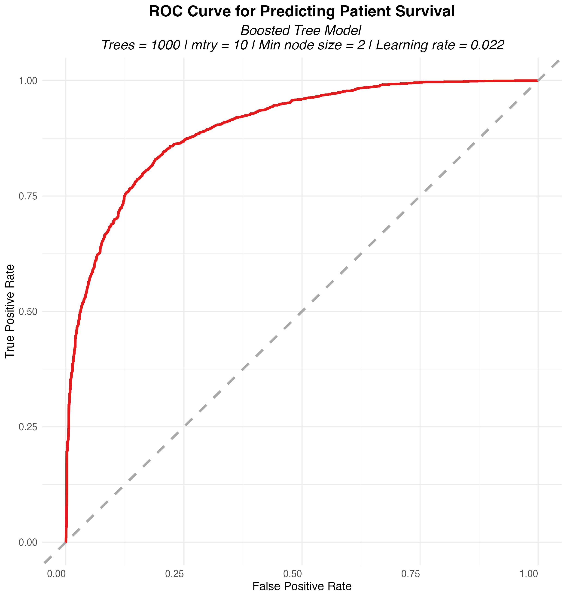{#fig-final-roc-auc}


The model’s classification behavior is further illustrated in the **confusion matrix** (@fig-final-conf-mat), which shows it correctly identified **2,848 survivors** and **1,089 deaths**. While 494 deaths were incorrectly predicted as survival cases (false negatives), and 318 survivors were misclassified as deaths (false positives), the true positive and true negative counts demonstrate a solid balance. This reinforces the model’s capability to recover meaningful patterns for both minority (death) and majority (survival) outcomes.

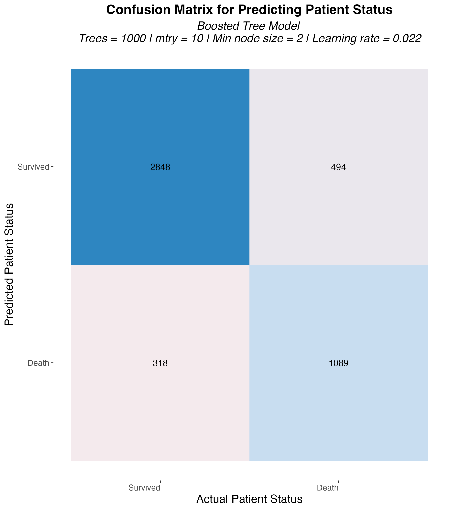{#fig-final-conf-mat}

Importantly, these testing results align closely with performance observed during cross-validation. As recorded in @tbl-roc-auc-1, the original boosted tree model achieved a **cross-validated ROC-AUC of 0.89472**, with a **standard error of just 0.00161** and a relatively low **runtime of 31 minutes**. Even after multiple rounds of preprocessing enhancement and hyperparameter refinement (@tbl-roc-auc-2 and @tbl-roc-auc-3), the model’s ROC-AUC plateaued around 0.89277—only a marginal improvement over the initial specification. However, these refinements increased runtime significantly, with the final version taking **556 minutes** to train. This suggests that while additional complexity may enhance interpretability or pipeline structure, it does not yield meaningful gains in performance for this particular model.


## Conclusion

Overall, the final boosted tree model offers a rare combination of **high ROC-AUC**, **stable accuracy**, **reasonable computational cost**, and **strong generalization** to new data. Among all models tested, the boosted tree achieved the **highest ROC-AUC (0.89472)** during the **initial model building phase** (@tbl-roc-auc-1), surpassing more complex or computationally intensive algorithms such as SVMs and neural networks. Notably, this strong performance was maintained throughout testing, where it achieved an **ROC-AUC of 0.89900** and **accuracy of 0.82902** (@tbl-metrics-final), confirming its robust predictive capabilities.

Interestingly, **subsequent rounds of model tuning and refinement**—which incorporated advanced preprocessing (e.g., interaction terms and bagged imputation), additional cross-validation, and extended training time—**did not yield significant performance gains**. As shown in @tbl-roc-auc-2 and @tbl-roc-auc-3, the ROC-AUC of the refined boosted tree model reached only 0.89277, which is marginally lower than its original performance during initial model building. Meanwhile, **runtime increased nearly 18-fold**, from 31 to 556 minutes. This plateauing in ROC-AUC despite increased computational burden highlights an important trade-off: **initial model simplicity paired with well-chosen hyperparameters can outperform over-engineered solutions**, especially when diminishing returns are evident.

In summary, the final boosted tree model remains the most reliable, performant, and deployable classifier in this study. However, ensemble learning and **smarter, more efficient tuning workflows** represent promising avenues for continued performance improvements.

### Future directions 

For future work, one promising direction is the **construction of ensemble models**, such as stacking or blending boosted trees with complementary learners like random forests or elastic net models. As demonstrated in earlier phases, the ensemble of **MARS and elastic net submodels** yielded a combined **ROC-AUC of 0.87951**, outperforming each submodel individually (Elastic Net = 0.87243; MARS = 0.85735) (@tbl-ensemble-roc-auc). This performance boost underscores the value of combining models with distinct learning strengths—elastic net offers regularization and interpretability, while MARS captures nonlinear interactions.

Extending this concept, an ensemble that incorporates **boosted trees**—already the best individual performer—may further enhance prediction by balancing its high sensitivity with the generalizability of more regularized or interpretable models. Such **hybrid ensembles** could improve robustness, reduce overfitting, and deliver more consistent performance across patient populations. Given the success of ensemble strategies in earlier modeling stages, a systematic exploration of stacking configurations that include boosted trees is a compelling future direction.^[For details on ensemble model performance, see [Appendix Section 3](file:///Users/bongbanana/Desktop/Stat%20301-3/final-project-3-women-in-stem/women_in_stem_final_report.html#ensemble-model)]

Additionally, **improvements to hyperparameter tuning strategies** could unlock further gains. For example, the **random forest model** already exhibited strong baseline performance (ROC-AUC = 0.88594) with minimal tuning. A more **targeted and narrowed search space**—such as focusing on smaller `mtry` values or fine-tuning minimum node sizes based on prior results—may uncover better submodels without expanding grid complexity or incurring excessive computation time. Likewise, for **boosted trees**, further exploration around **learning rates, tree depths, or early stopping criteria** could refine performance while preserving efficiency. These focused tuning adjustments can help strike a better balance between accuracy, robustness, and computational cost, especially when scaling models to real-world deployment.

## Use of Generative AI

We used **ChatGPT** to improve sentence flow, check grammar, and make my writing more concise. Additionally, we used it to identify and correct errors in my code, including debugging typos and deciphering error messages. 

## References
::: {#refs}
:::


## Appendix 
### 1. Interaction Effects: Age × Numeric Predictors

As shown in @fig-age-corr, the correlation plots display the linear relationships between **age** and various **numeric predictors** in the dataset. The bars are color-coded to distinguish between **positively** and **negatively** correlated features. This analysis was conducted to identify variables whose predictive influence may vary by age, making them strong candidates for interaction modeling in subsequent workflows.

In the upper portion of the figure, several variables show strong **positive correlations** with age. These include `apache_4a_hospital_death_prob`, `d1_potassium_min`, `diabetes_mellitus`, and `apache_4a_icu_death_prob`. Such variables tend to **increase with patient age** and are closely tied to either predicted mortality or chronic health conditions. Their correlation patterns suggest that older patients are more likely to enter the ICU with greater clinical severity and established comorbidities—factors that may interact meaningfully with age in determining outcomes.

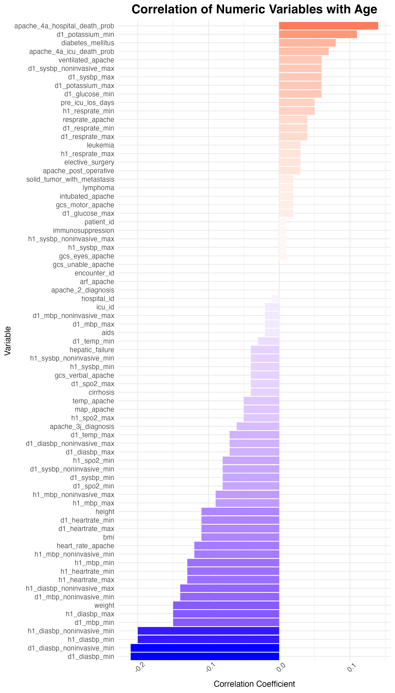{#fig-age-corr}

The lower portion of @fig-age-corr highlights variables that exhibit **negative correlations** with age, such as `d1_diastolic_bp_min`, `h1_heartrate_max`, `bmi`, and various minimum blood pressure readings. These patterns align with expected physiological changes associated with aging, including lower resting heart rate, decreased blood pressure, and reduced BMI. These declines in baseline physiological markers indicate that age could modify the importance of these features in predicting mortality, justifying their inclusion as **interaction terms**.

Altogether, @fig-age-corr provides compelling evidence for incorporating interactions between age and numerically correlated predictors into model recipes. While tree-based models can often capture such interactions implicitly, explicit modeling via `step_interact()` and `step_impute_bag` is particularly beneficial for linear and neural network models. This approach ensures that age-related moderation effects are not overlooked, thereby enhancing both model interpretability and predictive accuracy.

### 2. Tuning Analysis

#### a) Random Forest

The narrowing tuning process for the **random forest model** involved refining the search space for two key hyperparameters—**`mtry`** (predictors per split) and **`min_n`** (minimum observations per node)—while increasing the number of trees to enhance model stability.


```{r}
#| label: tbl-rf-param
#| echo: false
#| tbl-cap: "Comparison of hyperparameters for best random forest model before and after tuning refinement."

load(here::here("2_model_tuning/results/rf_param_compile.rda"))

knitr::kable(rf_param_compile, digits = 3)
```

Initially, broader values were explored (`mtry` up to 10, `min_n` ranging up to 40, and `trees = 1000`), but the early tuning stage showed diminishing improvements and wider variability across configurations (@fig-rf-tune-1). In response, the number of trees was **increased from 1000 to 2000** (@tbl-rf-param) to reduce variance in ROC-AUC estimates and ensure model robustness across resamples.

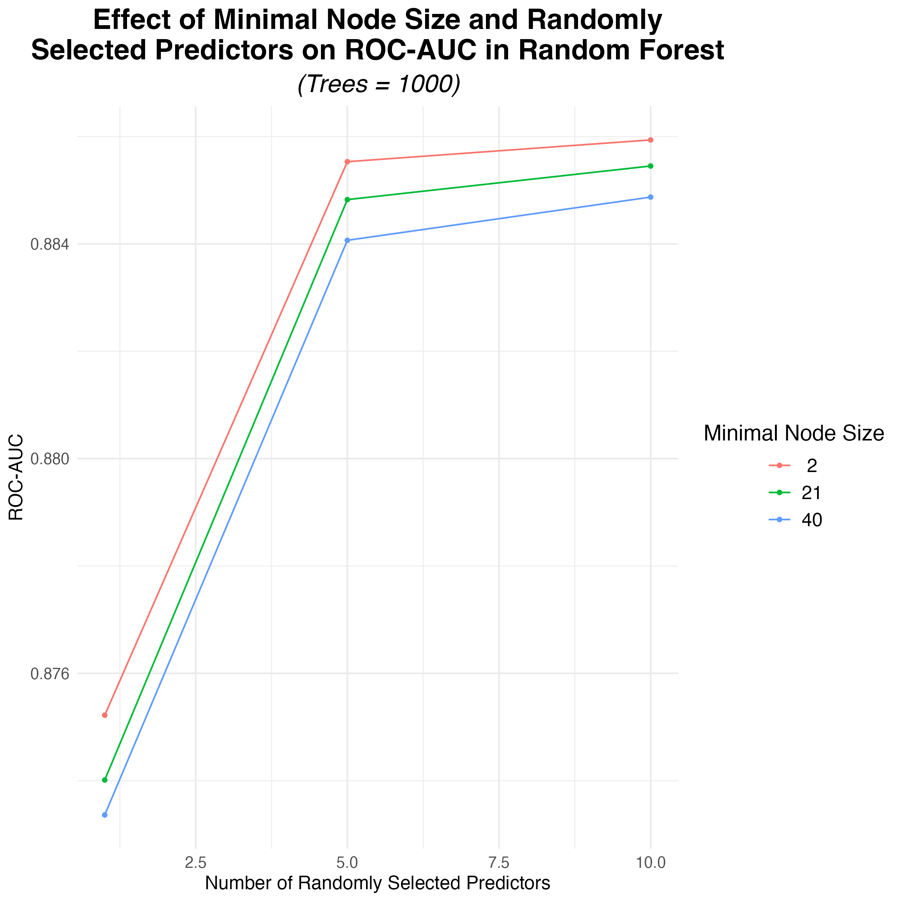{#fig-rf-tune-1}


The final grid used a more focused range of **`mtry = 20 to 30`** and **`min_n = 2 to 5`** (@tbl-rf-refine-tune), resulting in nine combinations. This refined grid captured performance variation more effectively, as shown in @fig-rf-tune-2, where **`min_n = 3`** and **`mtry = 20`** yielded the highest ROC-AUC. Compared to earlier results, performance differences became subtler, reflecting a zone of diminishing returns—yet small adjustments still affected model performance.

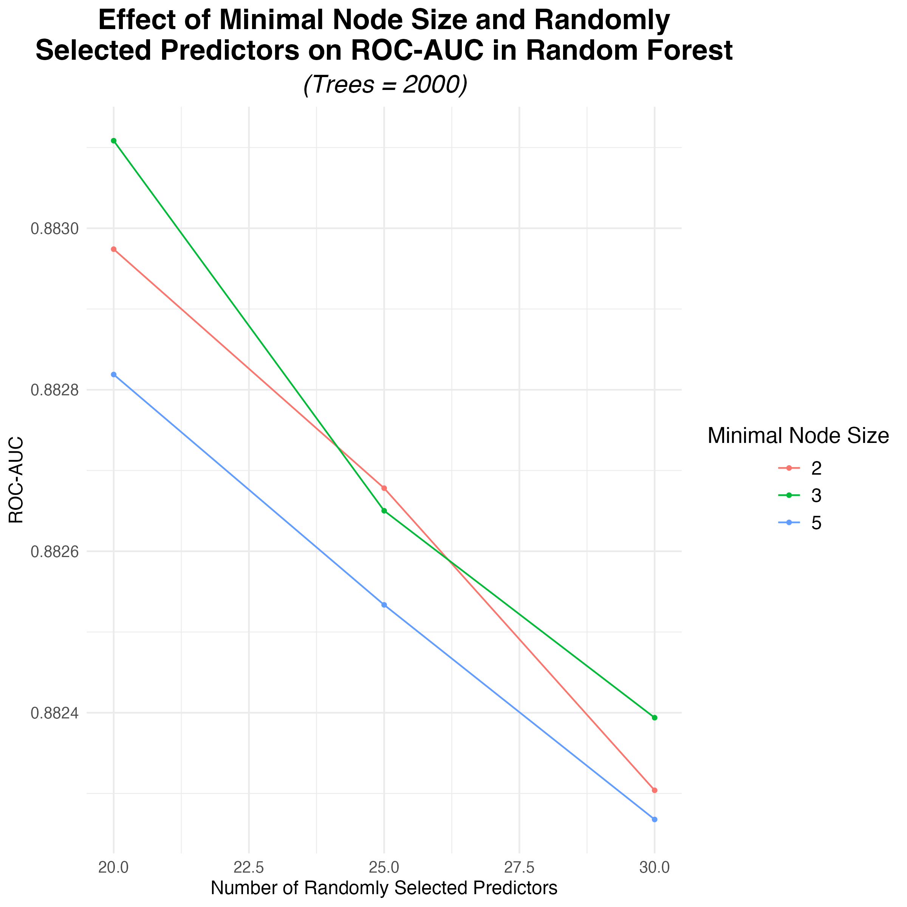{#fig-rf-tune-2}

Ultimately, the best refined configuration was **`trees = 2000`**, **`mtry = 20`**, and **`min_n = 3`** (@tbl-rf-param), which provided a balance between complexity, generalizability, and predictive accuracy.


#### b) Boosted Tree

The narrowing tuning process for the boosted tree model followed a two-step strategy: an initial broad search to identify general performance patterns and a refined search focused on optimal subregions of the hyperparameter space.

```{r}
#| label: tbl-bt-param
#| echo: false
#| tbl-cap: "Comparison of hyperparameters for best boostted tree model before and after tuning refinement."

load(here::here("2_model_tuning/results/bt_param_compile.rda"))

knitr::kable(bt_param_compile, digits = 3)
```

In the initial tuning phase, a wide range of values was tested for key parameters: the number of trees minimum node size, and learning rate (`learn_rate`). As shown in @fig-bt-tune-1, the model's **ROC-AUC performance improved** notably when **lower learning rates** (e.g., 0.001–0.022) and smaller node sizes (e.g., `min_n = 2`) were used. In contrast, **larger learning rates** (around 0.5) or **high minimum node sizes** (e.g., `min_n = 40`) led to **clear performance declines**. These early results helped narrow down which hyperparameter regions were most promising.

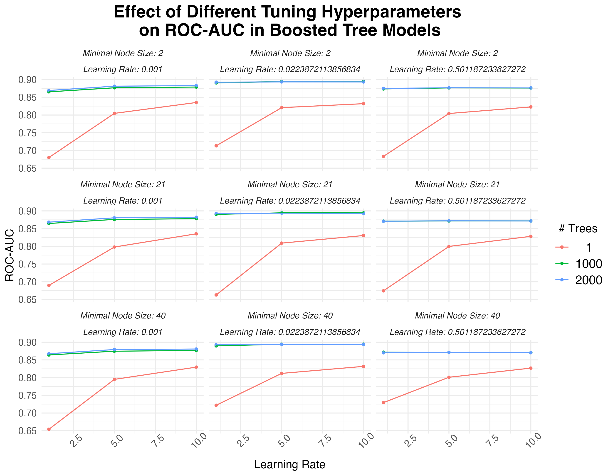{#fig-bt-tune-1}

In the refined grid search, the tuning space was adjusted more precisely. The hyperparameter `mtry` (number of predictors sampled at each split) was limited to **15–20**, `trees` was focused between **1000–2000**, `min_n` was restricted to **3–5**, and the `learn_rate` was refined to lie between **0.01 and 0.025** based on prior insights. This refined tuning grid is summarized in @tbl-bt-refine-tune, while performance trends are visualized in @fig-bt-tune-2. The plots reveal that **smaller learning rates consistently yielded higher ROC-AUC**, especially when paired with **larger tree counts** (e.g.,1666 or 2000). Although the effects of `mtry` and `min_n` were more modest, they still influenced performance stability.

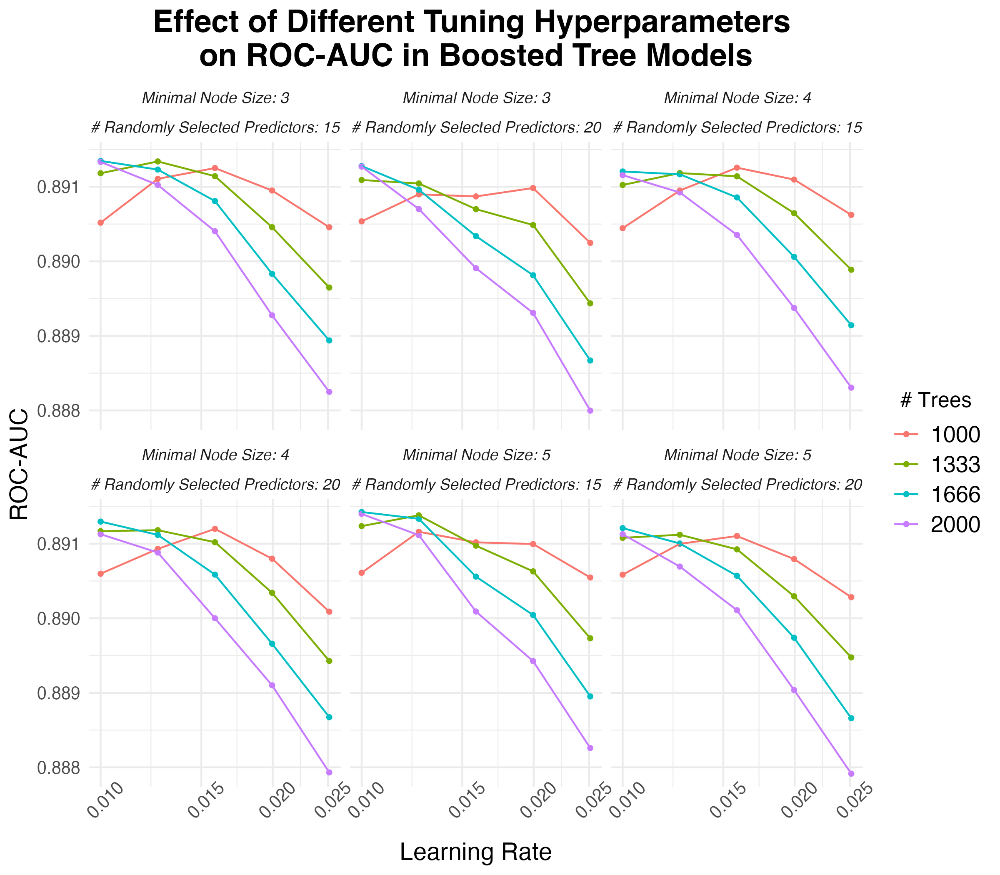{#fig-bt-tune-2}

The final selected hyperparameters —`mtry = 15`, `trees = 1666`, `min_n = 5`, and `learn_rate = 0.01`—are reported @tbl-bt-param. This configuration produced the highest validated performance during cross-validation, confirming that a focused, data-driven narrowing strategy effectively enhanced the model's predictive capability.

#### c) Neural Network

The narrowing tuning process for the neural network model was guided by a two-phase strategy: an initial broad search to explore overall parameter trends and a follow-up refined grid focusing on promising hyperparameter regions.

```{r}
#| label: tbl-nn-param
#| echo: false
#| tbl-cap: "Comparison of hyperparameters for best neural network model before and after tuning refinement."

load(here::here("2_model_tuning/results/nn_param_compile.rda"))

knitr::kable(nn_param_compile, digits = 3)
```

In the **initial tuning phase**, a broad range of values was explored for the number of hidden units and the amount of regularization (penalty). As shown in @fig-nn-tune-1, this wide grid revealed that model performance, measured by ROC-AUC, tended to **increase with higher hidden units and moderate-to-high levels of regularization** (on a log-10 scale). However, the performance varied significantly across the range, justifying a narrower and more focused tuning grid.


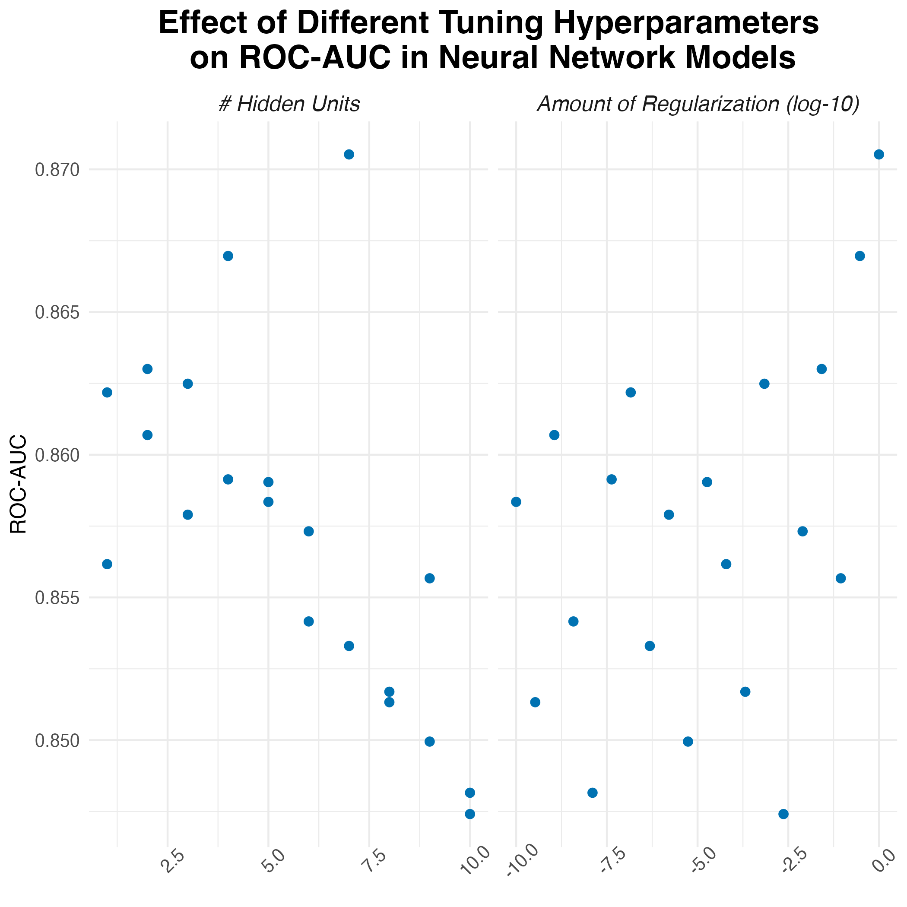{#fig-nn-tune-1}

Based on these insights, a refined grid was constructed with tighter value ranges around the most promising regions. As shown in @tbl-bt-refine-tune, the refined search examined **hidden units from 7 to 15**, **regularization penalties from $10^{-1}$ to $10^{0.5}$**, and **PCA components from 10 to 20**, each with **5 grid levels**.

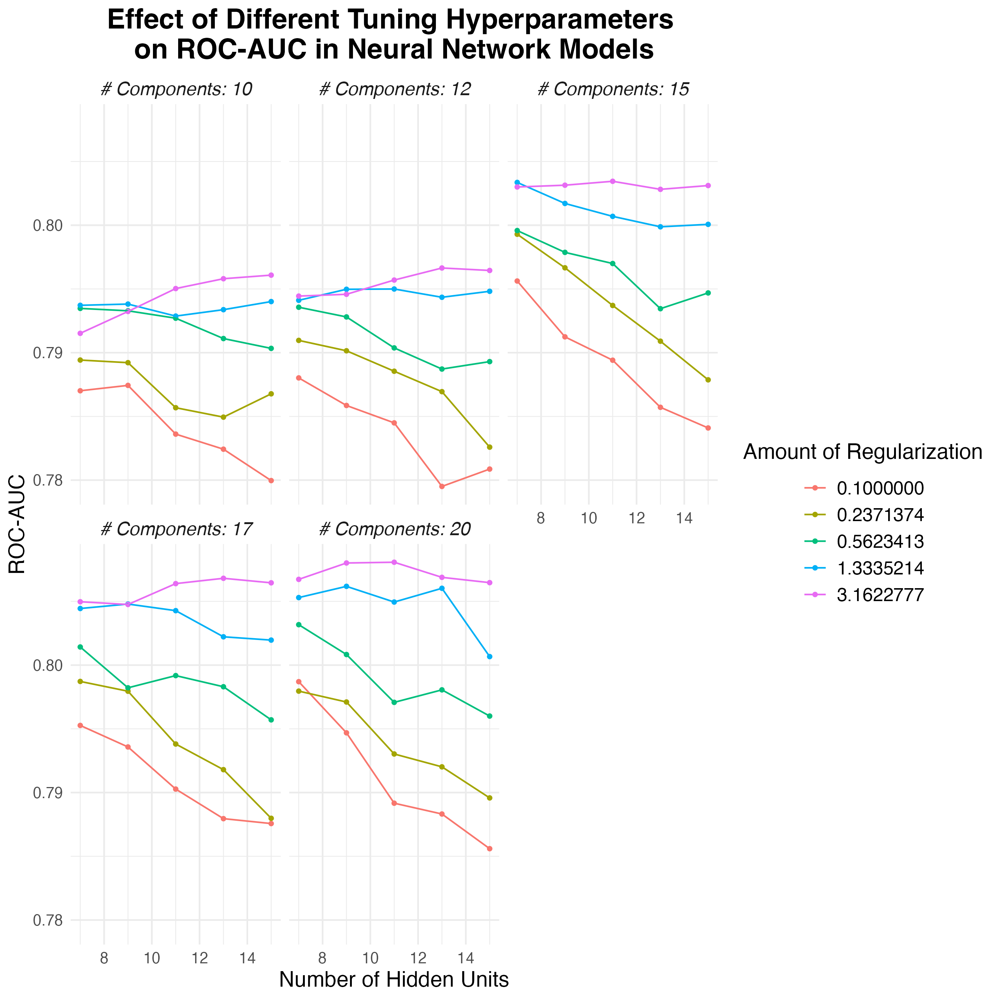{#fig-nn-tune-2}

The results of this refined tuning are visualized in @fig-nn-tune-2, where performance was plotted for combinations of hidden units and penalty levels across different numbers of PCA components. The plots show a clear trend: **models with a higher number of components and a moderate-to-high penalty generally performed better**. The optimal configuration, identified in @tbl-nn-param, selected **11 hidden units**, a **penalty of** approximately **3.162**, and **20 PCA components**.

### 3. Ensemble Model

The ensemble model, constructed by stacking selected elastic net and MARS submodels, achieved a **ROC-AUC of 0.87951** (@tbl-ensemble-roc-auc). While this indicates strong overall discrimination, it **falls short of the top-performing individual models**—specifically, the **boosted tree (ROC-AUC = 0.89472)** and the **random forest (ROC-AUC = 0.88594)** as seen in @tbl-roc-auc-1. This suggests that while ensemble learning typically aims to improve generalization by combining diverse learners, in this case, the component models may not have provided sufficient complementary strength to surpass the best tree-based methods.

```{r}
#| label: tbl-ensemble-roc-auc
#| echo: false
#| tbl-cap: "ROC-AUC performance of individual elastic net and MARS submodels, and their stacked ensemble."

load(here::here("1_model_building/results/ensemble_roc_auc.rda"))

knitr::kable(ensemble_roc_auc, digits = 5)
```


@fig-stack provides further insight into the ensemble’s behavior. The stacking coefficients indicate that the **elastic net (1_011)** submodel had the **largest influence** on the final prediction, with a coefficient of **3.51**, followed by MARS submodels **(1_3: 1.48)** and **(1_6: 0.58)**. Meanwhile, the second elastic net submodel **(1_021)** contributed negligibly (coefficient ≈ 0.01) (@tbl-ensemble-param). This uneven weighting suggests that the ensemble relied heavily on a **single strong submodel**, which limits the usual benefit of ensemble diversity. In contrast, boosted trees and random forests inherently integrate hundreds to thousands of diverse learners, enabling them to capture complex interactions more effectively.

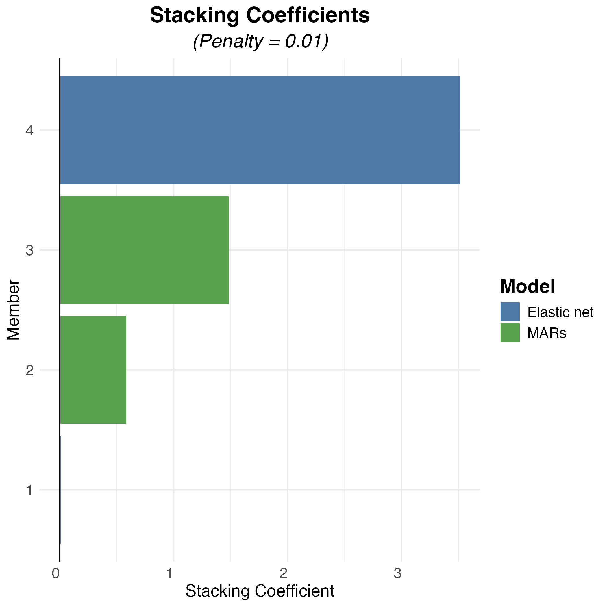{#fig-stack}


```{r}
#| label: tbl-ensemble-param
#| echo: false
#| tbl-cap: "Stacking coefficients and corresponding hyperparameters for the elastic net and MARS submodels included in the ensemble."

load(here::here("1_model_building/results/ensemble_param.rda"))

knitr::kable(ensemble_param, digits = 2)
```

Furthermore, the ensemble did not benefit from additional model complexity, as its performance gain over the best elastic net alone (0.87951 vs. 0.87243) was **modest**, and still underperformed compared to both tree-based methods. This indicates that in this context, tree ensembles offered a better balance of predictive accuracy and model robustness than the selected elastic net–MARS ensemble.
